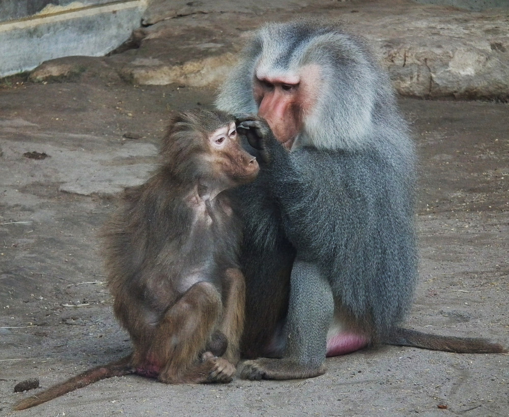
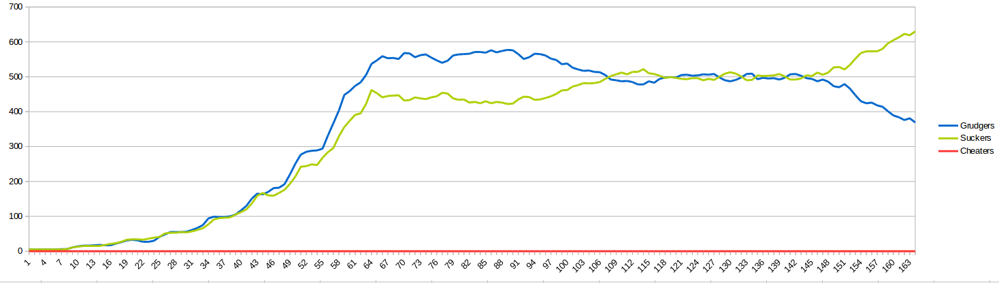
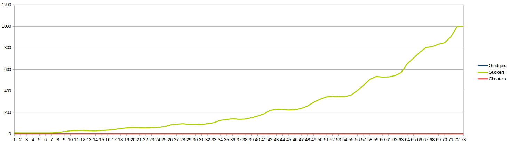
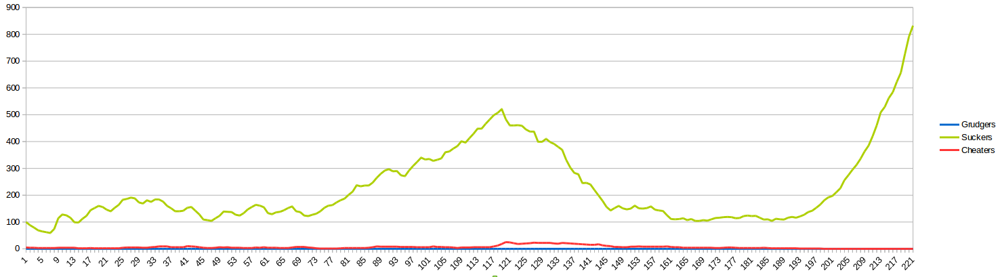
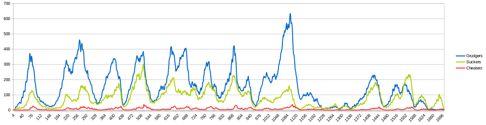
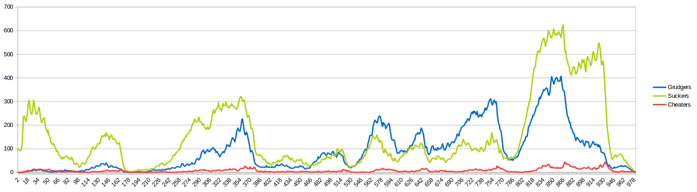

# Biological computer simulation of selfish genes

TL;DR: I did a computer simulation of behavior evolution of monkeys, continue reading to see how problem was stated originally in [The Selfish Gene](http://www.amazon.com/gp/product/0199291152/ref=as_li_tl?ie=UTF8&camp=1789&creative=390957&creativeASIN=0199291152&linkCode=as2&tag=javaandneighb-20&linkId=7SNF47P7MX5LWBNF). First part shows my [Java implementation](https://github.com/nurkiewicz/monkeys-grooming), second part shows charted results and conclusions.

---

# Problem

I read [The Selfish Gene](http://www.amazon.com/gp/product/0199291152/ref=as_li_tl?ie=UTF8&camp=1789&creative=390957&creativeASIN=0199291152&linkCode=as2&tag=javaandneighb-20&linkId=7SNF47P7MX5LWBNF) by [Richard Dawkins](http://www.amazon.com/Richard-Dawkins/e/B000AQ3RBI/?_encoding=UTF8&camp=1789&creative=390957&linkCode=ur2&tag=javaandneighb-20&linkId=2SIUP76MUBC5J2L7) recently, very wide-opening book despite being 40 years old. While the original text is sometimes outdated ("*you could pack only a few hundred transistors into a skull* - more like [trillions these days](http://en.wikipedia.org/wiki/Transistor_count), hello [Moore's law](http://en.wikipedia.org/wiki/Moore%27s_law)) general claims are as appealing as they used to. 

One chapter that especially grabbed my attention, as a computer engineer, was about animals performing [social grooming](http://en.wikipedia.org/wiki/Social_grooming), like some species of monkeys (see picture above). Let me quote [relevant chapter](https://archive.org/stream/TheSelfishGene/RichardDawkins-TheSelfishGene_djvu.txt):

> Suppose a species [...] is parasitized by a particularly nasty kind of [tick](http://en.wikipedia.org/wiki/Tick) which carries a dangerous disease. It is very important that these ticks should be removed as soon as possible. [...] An individual may not be able to reach his own head, but nothing is easier than for a friend to do it for him. Later, when the friend is parasitized himself, the good deed can be paid back. [...] This makes immediate intuitive sense. Anybody with conscious foresight can see that it is sensible to enter into mutual back-scratching arrangements. [...]

> Suppose B has a parasite on the top of his head. A pulls it off him. Later, the time comes when A has a parasite on his head. He naturally seeks out B in order that B may pay back his good deed. B simply turns up his nose and walks off. B is a cheat, an individual who accepts the benefit of other individuals' altruism, but who does not pay it back, or who pays it back insufficiently. Cheats do better than indiscriminate altruists because they gain the benefits without paying the costs. To be sure, the cost of grooming another individual's head seems small compared with the benefit of having a dangerous parasite removed, but it is not negligible. Some valuable energy and time has to be spent. 

> Let the population consist of individuals who adopt one of two strategies. [...] Call the two strategies Sucker and Cheat. Suckers groom anybody who needs it, indiscriminately. Cheats accept altruism from suckers, but they never groom anybody else, not even somebody who has previously groomed them. [...] the cheats will be doing better than the suckers. Even if the whole population declines toward extinction, there will never be any time when suckers do better than cheats. Therefore, as long as we consider only these two strategies, nothing can stop the extinction of the suckers and, very probably, the extinction of the whole population too. 

> But now, suppose there is a third strategy called Grudger. Grudgers groom strangers and individuals who have previously groomed them. However, if any individual cheats them, they remember the incident and bear a grudge: they refuse to groom that individual in the future. In a population of grudgers and suckers it is impossible to tell which is which. Both types behave altruistically towards everybody else [...]. If grudgers are rare in comparison with cheats, the grudger gene will go extinct. Once the grudgers manage to build up in numbers so that they reach a critical proportion, however, their chance of meeting each other becomes sufficiently great to off-set their wasted effort in grooming cheats. When this critical proportion is reached they will start to average a higher pay-off than cheats, and the cheats will be driven at an accelerating rate towards extinction. [...]

Quote from: [The Selfish Gene](http://www.amazon.com/gp/product/0199291152/ref=as_li_tl?ie=UTF8&camp=1789&creative=390957&creativeASIN=0199291152&linkCode=as2&tag=javaandneighb-20&linkId=7SNF47P7MX5LWBNF) by [Richard Dawkins](http://www.amazon.com/Richard-Dawkins/e/B000AQ3RBI/?_encoding=UTF8&camp=1789&creative=390957&linkCode=ur2&tag=javaandneighb-20&linkId=2SIUP76MUBC5J2L7), ISBN 0-19-857519-X.

Later on the author conducts a series of computer simulations to observe how these three strategies play together under various conditions. Obviously source code is not available, and I'm actually happy about it. Firstly because I had an opportunity to write some code for fun. Secondly: book was published in 1976, 4 years after C was invented and many years before C++ (to put you in perspective) and I am not really in a mood for (I guess) [Fortran](http://en.wikipedia.org/wiki/Fortran).

# Implementation

So I hacked few classes to perform a simulation of cheaters, suckers and grudgers throughout the population. I want to see how different types of behaviors affect population size. Which behavior is stable and guarantees survival. Finally how random mutations and deaths are mitigated. I decided to experiment with some techniques namely:

1. Hand-made dependency injection, no container whatsoever
2. Entirely single-threaded
3. Logical clock that is advanced explicitly to simulate time elapsing

We are going to simulate a population of monkeys (from just few to millions), each one with independent behavior, random life time and so on. It seems obvious to use multi-agent solution like actors or at least threads. However [*Principles of Reactive Programming*](https://www.coursera.org/course/reactive) course taught me that this is often an over-engineering. Essentially such a simulation is a sequence of events that should happen in the future: a monkey should be born in 2 years, should breed in 5 years and should die in 10. Of course there are many more such events and more monkeys. However it's enough to throw all these events into a single priority queue where closest events in the future are first. That's how [`Planner`](https://github.com/nurkiewicz/monkeys-grooming/blob/master/src/main/java/com/nurkiewicz/monkeys/simulation/Planner.java) is essentially implemented:

	public abstract class Action implements Comparable<Action> {
	
	    private final Instant schedule;
	
	    public Action(Clock simulationTime, Duration delay) {
	        this.schedule = simulationTime.instant().plus(delay);
	    }
	
	    @Override
	    public int compareTo(Action other) {
	        return this.schedule.compareTo(other.schedule);
	    }
	
	    public abstract void run();
	
	}
	
	//...

	public class Planner implements Runnable {
		
	    private final Queue<Action> pending = new PriorityQueue<>();
	    private final SimulationClock simulationClock;
	
	    public void schedule(Action action) {
	        pending.add(action);
	    }
	
	    @Override
	    public void run() {
	        while (!pending.isEmpty()) {
	            Action nearestAction = pending.poll();
	            simulationClock.advanceTo(nearestAction.getSchedule());
	            nearestAction.run();
	        }
	    }
	}

We have an [`Action`](https://github.com/nurkiewicz/monkeys-grooming/blob/master/src/main/java/com/nurkiewicz/monkeys/actions/Action.java) with predefined `schedule` (*when* it should be executed) and a `pending` queue of future actions. There is no need to wait, we just pick nearest action from the future and advance simulation time:

	import java.time.Clock;

	public class SimulationClock extends Clock {

	    private Instant simulationNow = Instant.now();

	    @Override
	    public Instant instant() {
	        return simulationNow;
	    }

	    public void advanceTo(Instant instant) {
	        simulationNow = instant;
	    }

	}

So we essentially implemented an [event loop](http://en.wikipedia.org/wiki/Event_loop) where events can be added anywhere within the queue (not necessarily at the end). Now when we have a basic framework, let's implement monkeys' behaviors:

	public class Sucker extends Monkey {
	    //...

	    @Override
	    public boolean acceptsToGroom(Monkey monkey) {
	        return true;
	    }

	}

	public class Cheater extends Monkey {

	    private final double acceptProbability;

	    //...

	    @Override
	    public boolean acceptsToGroom(Monkey monkey) {
	        return Math.random() < acceptProbability;
	    }
	}

	public class Grudger extends Monkey {

	    private final Set<Monkey> cheaters = new HashSet<>();

	    @Override
	    public boolean acceptsToGroom(Monkey monkey) {
	        return !cheaters.contains(monkey);
	    }

	    @Override
	    public void monkeyRejectedToGroomMe(Monkey monkey) {
	        cheaters.add(monkey);
	    }

	}

As you can see these three classes capture three different behaviors. `Sucker`s always accept grooming requests, `Cheater`s only sometimes (in original simulation - never, but I made this configurable), `Grudger`s remember who rejected their request previously. Monkeys are aggregated within a class `Population`, here is a small snippet:

	public class Population {

	    private final Set<Monkey> monkeys = new HashSet<>();
	    private final MonkeyFactory monkeyFactory;

	    private Population addMonkey(Monkey child) {
	        if (!full()) {
	            newMonkey(child);
	        }
	        return this;
	    }

	    private boolean full() {
	        return monkeys.size() >= environment.getMaxPopulationSize();
	    }

	    private void newMonkey(Monkey child) {
	        monkeys.add(child);
	        planner.scheduleMonkeyLifecycle(child, this);
	        log.debug("New monkey in population {}total {}", child, monkeys.size());
	    }

	//...
	}

For each new monkey we schedule its so-called lifecycle, i.e. events related to breeding, grooming and death (in `Planner`):

    void scheduleMonkeyLifecycle(Monkey child, Population population) {
        askForGrooming(child, environment.getParasiteInfection().make(), population);
        scheduleBreedings(child, population);
        kill(child, environment.getLifetime().make(), population);
    }

    void askForGrooming(Monkey child, Duration parasiteInfection, Population population) {
        schedule(new AskForGrooming(child, parasiteInfection, population));
    }

    private void scheduleBreedings(Monkey child, Population population) {
        final int childrenCount = RANDOM.nextInt(environment.getMaxChildren() + 1);
        IntStream.
                rangeClosed(1, childrenCount)
                .forEach(x -> breed(child, environment.getBreeding().make(), population));
    }

    void kill(Monkey child, Duration lifetime, Population population) {
        schedule(new Kill(child, lifetime, population));
    }

    private void breed(Monkey child, Duration breeding, Population population) {
        schedule(new Breed(child, breeding, population));
    }

[`AskForGrooming`](https://github.com/nurkiewicz/monkeys-grooming/blob/master/src/main/java/com/nurkiewicz/monkeys/actions/AskForGrooming.java), [`Kill`](https://github.com/nurkiewicz/monkeys-grooming/blob/master/src/main/java/com/nurkiewicz/monkeys/actions/Kill.java), [`Breed`](https://github.com/nurkiewicz/monkeys-grooming/blob/master/src/main/java/com/nurkiewicz/monkeys/actions/Breed.java), etc. are instances of already mentioned `Action` class, e.g. `Kill`:

	public class Kill extends MonkeyAction {
	    private final Population population;

	    public Kill(Monkey monkey, Duration lifetime, Population population) {
	        super(monkey, lifetime);
	        this.population = population;
	    }

	    @Override
	    public void run(Monkey monkey) {
	        population.kill(monkey);
	    }
	}

I encapsulate all simulation parameters in a simple value class [`Environment`](https://github.com/nurkiewicz/monkeys-grooming/blob/master/src/main/java/com/nurkiewicz/monkeys/simulation/Environment.java), many parameters like `parasiteInfection`, `lifetime` or `breeding` aren't constants but instances of [`RandomPeriod`](https://github.com/nurkiewicz/monkeys-grooming/blob/master/src/main/java/com/nurkiewicz/monkeys/RandomPeriod.java) class:

	@Value
	public class RandomPeriod {

	    private static final Random RANDOM = new Random();

	    Period expected;
	    Period stdDev;

	    public Duration make() {
	        final long shift = Periods.toDuration(expected).toMillis();
	        final long stdDev = Periods.toDuration(this.stdDev).toMillis();
	        final double gaussian = RANDOM.nextGaussian() * stdDev;
	        double randomMillis = shift + gaussian;
	        return Duration.ofMillis((long) randomMillis);
	    }

	}

This allowed me to capture the concept of random period of time with expected value, standard deviation and [normal distribution](http://en.wikipedia.org/wiki/Normal_distribution). `make()` method simply generates one such random period. I am not going to explore full source code of this simulation, it's [available on GitHub](https://github.com/nurkiewicz/monkeys-grooming). Now it's finally time to run it a few times and observe how population grows (or extincts). By the way I use the same planner and action mechanism to peek what happens: I simply inject [`Probe`](https://github.com/nurkiewicz/monkeys-grooming/blob/master/src/main/java/com/nurkiewicz/monkeys/actions/Probe.java) action once every year (logical time!) and output the current population size.

Just as with many event loops, there must be just one thread accessing events. We followed this practice, the simulation is single-threaded, thus there is no need to perform any synchronization or locking at all, we can also use standard, unsafe but faster collections. Less context switches and improved cache locality help as well. Also we can easily dump simulation state to disk, e.g. to restore it later. Of course there are drawbacks. With thousands of monkeys the simulation slows down and there is not much we can do about it, except careful optimization and buying faster CPU (not even more CPUs!)

---

# The experiment

As a control group we start with a tiny (10 specimens) population consisting solely of suckers and a mixture of suckers and grudgers. In the absence of cheaters these two behaviors are indistinguishable. We turn off mutation (a possibility that a child of sucker and grudger will become a cheater, rather then sucker or grudger as well) and see how population grows (X axis represents time, Y axis is the population size):

Notice that the proportion of suckers and grudgers fluctuates around 50% since these two behaviors are doing exactly the same. There is no point in running a simulation with few cheaters only. Since they generally don't groom each other, they quickly die, erasing the "*cheating gene*". On the other hand suckers only (without mutation) are growing exponentially (you can clearly see new generations being born after plateaus):

However what would happen if we simulate a population with 100 suckers and just 5 cheaters? Mutations are again turned off to keep simulation clean:

There are two possible scenarios: either cheaters gene disappears or it spreads and cause the population to extinct. It's kind of a paradox - if this particular gene wins, the whole population (including that gene!) is doomed. Now let's simulate something more interesting. We turn on 5% mutation probability and ask cheaters to groom in 9 out of 10 cases (so they behave somewhat like suckers). We start with a healthy population of 5 suckers and 5 grudgers:

Do you see how grudgers quickly expand and almost always outnumber suckers? That's because suckers are much more vulnerable in an environment where cheaters sometimes appear due to a mutation. Did you noticed how population quickly shrinks every time even a small number of suckers appear? Grudgers are vulnerable as well: they groom newborn cheaters without knowing yet who they are. However they don't repeat this mistake like suckers do. That's why suckers always loose, but they don't extinct entirely since they are somewhat protected by grudgers. Not directly, but grudgers kill cheaters by not grooming them, reducing the threat. That's how different behaviors cooperate. So why did the population extinct after all? Look carefully at the end of the chart, at some point for a random reason the suckers outnumbered grudgers - this was especially possible in the absence of cheaters at that time. So what happened? A few cheaters appeared suddenly due to a mutation and this society of monkeys was doomed.

Now let's study another example: a mature society of 100 suckers living already, no other behaviors observed. Of course due to a mutation grudgers and cheaters quickly emerge. Most of the times this simulation ends very quickly, just after few generations. The probability of cheater being born is the same as the probability of grudger, but we need way more grudgers to protect suckers. Thus the population dies. But I managed to run few simulations where such society actually survived for a while:

Interestingly suckers dominated in the population for quite some time, but yet another *epidemic* attack of cheaters killed most of suckers. Unfortunately the last growth of cheaters reduced the number of grudgers to the point when they could no longer protect suckers and suddenly everyone dies.

---

# Summary

From implementation perspective using single-threaded model and an action queue worked really good, despite being hard to scale. However the biological conclusions are much more interesting:

* An altruistic population (*suckers* only) can live happily forever, as long as there are no cheaters, trying to exploit the system
* The presence of a single cheater in an altruistic population can cause such population to collapse
* Population needs guards (*grudgers*) that protect from cheaters
* Even in the presence of guards there is still place for small amount of cheaters that remain unnoticed
* If the number of cheaters exceed some critical ratio, the population can no longer protect itself and gives up. Every specimen dies, including cheaters
* Genes that are generally bad for a population extinct, even if this drags down the whole population

You are free to extend conclusions to human society. [Full source code](https://github.com/nurkiewicz/monkeys-grooming) is available on GitHub, feel free to experiment, pull requests are welcome as well!